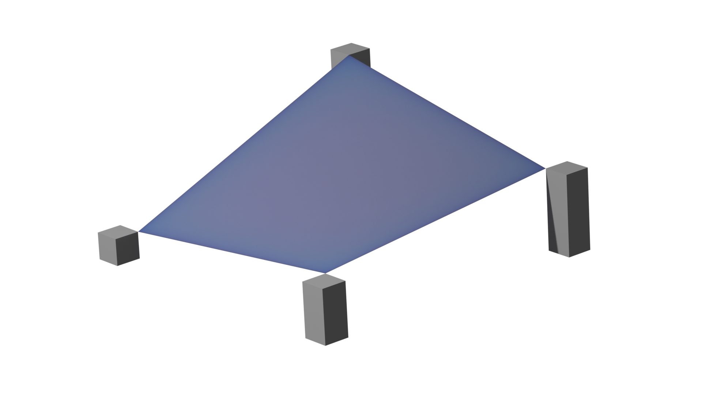

# interpylate

<p align="center">
  
</p>

**interpylate** is a Python library for N-linear regular grid interpolation. It provides a flexible and efficient method to interpolate N-dimensional arrays using a N-linear approach, making it particularly useful for image interpolation and its higher-dimensional equivalents.

## Installation

```bash
pip install interpylate
```

## Dependencies

- `numpy`: Core dependency for array operations

## Architecture

The library is structured with a unified interface and specialized implementations:

- `NLinearRegularGridInterpolator`: A unified interface that automatically selects the appropriate dimension-specific implementation based on the input dimension
  - For dimensions > 3, it utilizes `NLinearRegularGridInterpolatorLarge`
- `LinearRegularGridInterpolator`: Optimized for 1D arrays
- `BiLinearRegularGridInterpolator`: Optimized for 2D arrays (images)
- `TriLinearRegularGridInterpolator`: Optimized for 3D arrays (volumes)
- `NLinearRegularGridInterpolatorLarge`: Less optimized general implementation for any dimensions

This design provides both optimization for common cases and flexibility for higher dimensions.

## Usage

```python
from interpylate import NLinearRegularGridInterpolator

# Create an instance of the interpolator
# This will automatically select the appropriate implementation based on dimension
interpolator = NLinearRegularGridInterpolator(dim=3)

# Evaluate the interpolation at specified coordinates
interpolated_values = interpolator.evaluate(NDarray, continuous_inds)

# Compute the gradient of the interpolated array
gradient = interpolator.grad(NDarray, continuous_inds, evaluate_too=False)

# Compute the hessian of the interpolated array
hessian = interpolator.hess(NDarray, continuous_inds, grad_too=False, evaluate_too=False)
```

## Main Features

- **Dimension-agnostic API**: Work with arrays of any dimension using a consistent interface
- **Performance-optimized implementations**: Specialized algorithms for 1D, 2D, and 3D cases
- **Gradient computation**: Calculate first-order derivatives of interpolated arrays
- **Hessian computation**: Compute second-order derivatives for advanced analysis
- **Regular grid support**: Designed specifically for regular grid structures

## Examples

The interpylate GitHub repository includes several example scripts demonstrating the library's capabilities:

- **1D Interpolation**: Basic interpolation for one-dimensional arrays
- **2D Interpolation**: Image interpolation techniques
- **3D Interpolation**: Volume data interpolation methods
- **Speed Contest**: Performance comparison between interpylate's TriLinearRegularGridInterpolator and scipy.interpolate.RegularGridInterpolator

## Documentation

The full API documentation is available in the docs/ directory of the project or via the [online documentation portal](https://dorian210.github.io/interpylate/).

## Contributing

At the moment, I am not actively reviewing contributions. However, if you encounter issues or have suggestions, feel free to open an issue.

## License

This project is licensed under the [CeCILL License](LICENSE.txt).